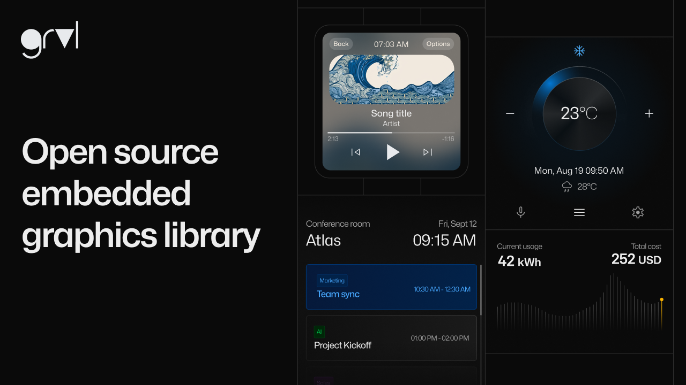

# grvl - Graphics Rendering Visual Library

Copyright (c) 2015 - 2024 [Antmicro](https://www.antmicro.com)

<picture>
  <!-- User prefers light mode: -->
  <source srcset="images/grvl_logo_black.png" media="(prefers-color-scheme: light)"/>

  <!-- User prefers dark mode: -->
  <source srcset="images/grvl_logo_white.png"  media="(prefers-color-scheme: dark)"/>

  <!-- User has no color preference: -->
  
</picture>

Graphics Rendering Visual Library (grvl) is an open source library for creating rich, modern, animated graphical user interfaces, developed for use on constrained devices like MCUs.

Grvl is designed to be portable, currently supporting standalone [Simple DirectMedia Layer](https://github.com/libsdl-org/SDL) (SDL) based applications and [Zephyr RTOS](https://zephyrproject.org/).

With its collection of built-in widgets, XML-based config and support for reconfiguration in runtime, grvl was created with ease of use for both designers and developers in mind.



## Features

* A sizable collection of widgets to build your UIs from:
    * View widgets: GridView, ListView, CustomView, Panel
    * Buttons: Button, SwitchButton, Slider
    * Progress bars: ProgressBar, CircleProgessBar
    * Other: Clock, Image, Label
* Designer-friendly, XML-based configuration and view description
    * Supports reconfiguration of the UI in runtime
* Small memory footprint allowing running GRVL on constrained devices
* Easily portable

## Quick start

### Standalone

Build using CMake:
```sh
$ cmake -B build .
$ cmake --build build/ --target grvl
```
### Zephyr

Pull the source code (e.g. using `west`) and add the following in your `CMakeLists.txt` file:

```
set(GRVL_ZEPHYR ON)
add_subdirectory(<grvl_path>)
    ...
target_link_libraries(app PRIVATE grvl)
```

## grvl Documentation

[Grvl Documentation](https://antmicro.github.io/grvl) provides an overview of grvl's usage as well as a detailed description of the API.
